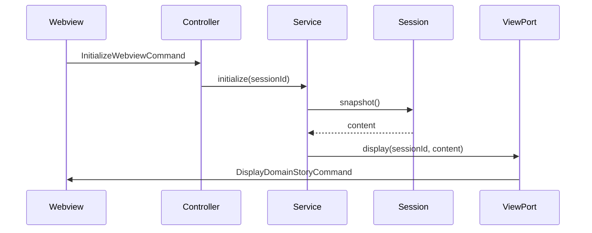
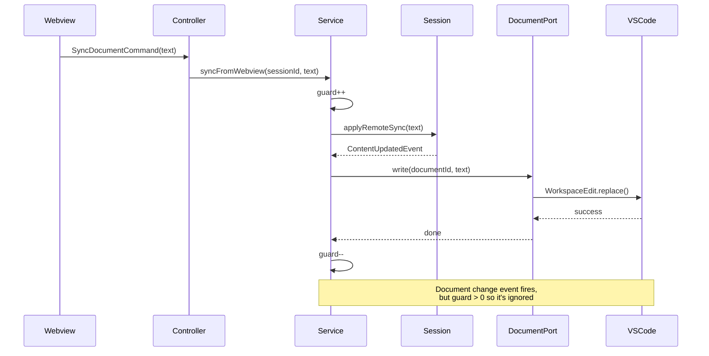
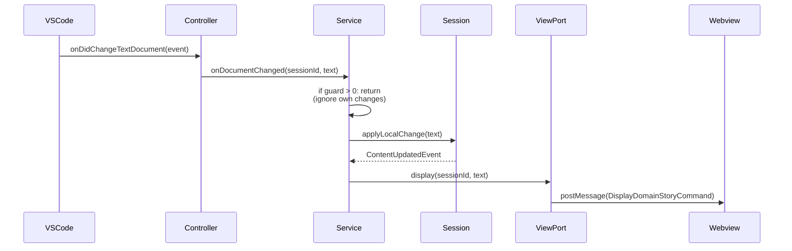
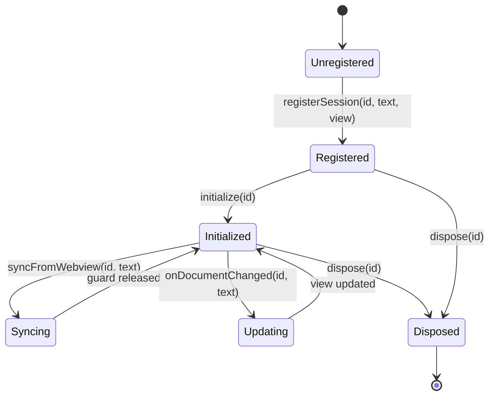

# Architecture Documentation

## Overview

The Domain Story library implements a clean Domain-Driven Design (DDD) architecture with three distinct layers: Domain, Application, and Infrastructure. This separation ensures maintainability, testability, and extensibility.

## Architectural Layers

### Layer Diagram

```
┌─────────────────────────────────────────────────────────────┐
│                     VS Code Extension                       │
│                   (WebviewController)                       │
│                         Edge Layer                          │
└────────────────────────┬────────────────────────────────────┘
                         │
                         ├─── Dependency Injection (tsyringe)
                         │
┌────────────────────────▼────────────────────────────────────┐
│                  Infrastructure Layer                       │
│                                                             │
│  ┌──────────────────┐         ┌──────────────────┐        │
│  │ VsCodeDocumentPort│         │  VsCodeViewPort  │        │
│  │  (Adapts VS Code) │         │ (Adapts Webview) │        │
│  └──────────────────┘         └──────────────────┘        │
└────────────────────────┬────────────────────────────────────┘
                         │
                         │ implements Ports
                         │
┌────────────────────────▼────────────────────────────────────┐
│                   Application Layer                         │
│                                                             │
│  ┌──────────────────────────────────────────────┐          │
│  │      DomainStoryEditorService                │          │
│  │  (Orchestrates use cases & sessions)         │          │
│  └──────────────────────────────────────────────┘          │
│                                                             │
│  ┌──────────────┐              ┌──────────────┐           │
│  │ DocumentPort │              │   ViewPort   │           │
│  │  (Interface) │              │  (Interface) │           │
│  └──────────────┘              └──────────────┘           │
└────────────────────────┬────────────────────────────────────┘
                         │
                         │ uses
                         │
┌────────────────────────▼────────────────────────────────────┐
│                      Domain Layer                           │
│                                                             │
│  ┌──────────────────────────────────────────────┐          │
│  │          EditorSession Aggregate             │          │
│  │  (Pure domain logic, no dependencies)        │          │
│  └──────────────────────────────────────────────┘          │
└─────────────────────────────────────────────────────────────┘
```

## Layer Responsibilities

### 1. Domain Layer

**Purpose**: Pure business logic with zero external dependencies.

**Components**:

- `EditorSession`: Aggregate root that manages editor state and sync guard
- `ContentUpdatedEvent`: Domain event emitted on changes
- `ContentOrigin`: Value object ('local' | 'remote')

**Rules**:

- No dependencies on frameworks (VS Code, React, etc.)
- No I/O operations
- Only business logic and invariants
- Fully unit testable without mocks

**Example**:

```typescript
export class EditorSession {
    constructor(
        readonly id: string,
        private content: string,
    ) {}

    applyLocalChange(text: string): ContentUpdatedEvent {
        this.content = text;
        return { type: 'ContentUpdated', origin: 'local', text };
    }
}
```

### 2. Application Layer

**Purpose**: Orchestrates use cases and defines contracts (ports) for infrastructure.

**Components**:

- `DomainStoryEditorService`: Application service managing sessions
- `DocumentPort`: Interface for document I/O
- `ViewPort`: Interface for webview communication

**Rules**:

- Depends on domain layer
- No framework dependencies (only interfaces)
- Coordinates workflows between domain and infrastructure
- Contains business use cases

**Example**:

```typescript
@injectable()
export class DomainStoryEditorService {
    constructor(private docs: DocumentPort) {}

    async syncFromWebview(sessionId: string, text: string): Promise<void> {
        const state = this.get(sessionId);
        if (!state) return;
        
        state.guard++;  // Prevent echo
        state.session.applyRemoteSync(text);
        await this.docs.write(this.getDocumentIdFromSessionId(sessionId), text);
        state.guard--;
    }
}
```

### 3. Infrastructure Layer

**Purpose**: Implements ports using framework-specific code.

**Components**:

- `VsCodeDocumentPort`: Adapts VS Code workspace API
- `VsCodeViewPort`: Adapts VS Code webview API

**Rules**:

- Implements application layer ports
- Contains all VS Code dependencies
- Can be swapped without changing domain/application

**Example**:

```typescript
export class VsCodeDocumentPort implements DocumentPort {
    async write(documentId: string, text: string): Promise<void> {
        const uri = Uri.file(documentId);
        const edit = new WorkspaceEdit();
        edit.replace(uri, new Range(0, 0, 9999, 0), text);
        await workspace.applyEdit(edit);
    }
}
```

## Data Flow Diagrams

### Initialize Flow



### Webview → Document Sync Flow



### Document → Webview Sync Flow



## Session State Management

### Session Lifecycle



### Session State Structure

```typescript
interface SessionState {
    guard: number;          // Sync guard counter (0 = idle, >0 = syncing)
    session: EditorSession; // Domain aggregate
    view: ViewPort;         // View adapter
}

// Managed by DomainStoryEditorService
private
sessions = new Map<sessionId, SessionState>();
```

## Dependency Flow

### Compile-Time Dependencies

```mermaid
graph TD
    A[WebviewController] -->|depends on| B[DomainStoryEditorService]
    A -->|depends on| C[VsCodeViewPort]
    
    B -->|depends on| D[DocumentPort interface]
    B -->|depends on| E[ViewPort interface]
    B -->|depends on| F[EditorSession]
    
    C -->|implements| E
    G[VsCodeDocumentPort] -->|implements| D
    
    F -->|no dependencies| H[Pure TypeScript]
    
    style F fill:#1a1a2e
    style H fill:#1a1a2e
    style D fill:#16213e
    style E fill:#16213e
```



### Runtime Dependencies (Dependency Injection)

```typescript
// main.config.ts
container.register<DocumentPort>("DocumentPort", {
    useClass: VsCodeDocumentPort,  // ← Infrastructure
});

container.register<DomainStoryEditorService>(DomainStoryEditorService, {
    useFactory: (c) => {
        const docs = c.resolve<DocumentPort>("DocumentPort");
        return new DomainStoryEditorService(docs);  // ← Application
    },
});

// WebviewController receives DomainStoryEditorService via DI
```

## Echo Prevention Mechanism

### Problem

Without guards, bidirectional sync creates infinite loops:

```
User edits document
  → Document change event fires
    → Update webview
      → Webview syncs back
        → Document change event fires
          → Update webview
            → ∞ loop
```

### Solution: Per-Session Guards

```typescript
async syncFromWebview(sessionId: string, text: string): Promise<void> {
    const state = this.get(sessionId);
    if (!state) return;
    
    state.guard++;  // 🔒 Lock: "We're updating the document"
    state.session.applyRemoteSync(text);
    await this.docs.write(thisGetDocumentIdFromSessionId(sessionId), text);  // ← This triggers onDidChangeTextDocument
    state.guard--;  // 🔓 Unlock
}

async onDocumentChanged(sessionId: string, text: string): Promise<void> {
    const state = this.get(sessionId);
    if (!state || state.guard > 0) {  // ← Skip if locked
        return;  // "This change came from us, ignore it"
    }
    
    state.session.applyLocalChange(text);
    await state.view.display(sessionId, text);
}
```

### Guard Timeline

```
Time →

t0: User types in webview
t1: SyncDocumentCommand arrives
t2: guard++ (guard = 1)
t3: document.write() called
t4: onDidChangeTextDocument fires → guard > 0 → SKIP ✓
t5: guard-- (guard = 0)
t6: User edits text document directly
t7: onDidChangeTextDocument fires → guard = 0 → Update webview ✓
```

## Design Patterns Used

### 1. Ports and Adapters (Hexagonal Architecture)

- **Ports**: `DocumentPort`, `ViewPort` (interfaces in application layer)
- **Adapters**: `VsCodeDocumentPort`, `VsCodeViewPort` (infrastructure)

### 2. Aggregate Pattern

- `EditorSession` is the aggregate root
- Encapsulates state and business rules
- Emits domain events

### 3. Application Service Pattern

- `DomainStoryEditorService` coordinates workflows
- Manages multiple aggregates (sessions)
- Prevents echo loops with guards

### 4. Dependency Injection

- Constructor injection via `tsyringe`
- Interfaces injected, implementations resolved at runtime

## Testing Strategy

### Unit Tests (Domain Layer)

```typescript
describe('EditorSession', () => {
    it('applies local changes', () => {
        const session = new EditorSession('test', 'initial');
        const event = session.applyLocalChange('updated');
        
        expect(event.origin).toBe('local');
        expect(session.snapshot()).toBe('updated');
    });
});
```

### Integration Tests (Application Layer)

```typescript
describe('DomainStoryEditorService', () => {
    let service: DomainStoryEditorService;
    let mockDocs: DocumentPort;
    let mockView: ViewPort;

    beforeEach(() => {
        mockDocs = { read: jest.fn(), write: jest.fn() };
        mockView = { display: jest.fn() };
        service = new DomainStoryEditorService(mockDocs);
    });

    it('prevents echo loops', async () => {
        service.registerSession('test', 'initial', mockView);
        
        await service.syncFromWebview('test', 'updated');
        await service.onDocumentChanged('test', 'updated');
        
        expect(mockView.display).not.toHaveBeenCalled();
    });
});
```

### E2E Tests

Test the full stack with real VS Code extension host.

## Extension Points

### Add New Ports

```typescript
// New port interface
export interface LoggerPort {
    log(message: string): void;
}

// Implementation
export class ConsoleLoggerPort implements LoggerPort {
    log(message: string): void {
        console.log(message);
    }
}

// Use in service
constructor(
    private docs: DocumentPort,
    private logger: LoggerPort,  // ← New dependency
) {}
```

### Add New Domain Events

```typescript
export interface ContentValidatedEvent {
    type: 'ContentValidated';
    isValid: boolean;
    errors: string[];
}

export class EditorSession {
    validate(text: string): ContentValidatedEvent {
        // Validation logic
    }
}
```

## Performance Considerations

### Session Cleanup

Always call `dispose(sessionId)` when closing editors to prevent memory leaks:

```typescript
webviewPanel.onDidDispose(() => {
    this.app.dispose(sessionId);  // ← Essential
});
```

### Guard Overhead

The guard mechanism adds minimal overhead:

- Increment/decrement operations: O(1)
- No async overhead
- Per-session isolation prevents contention

## Migration Guide

### From Old Architecture

**Before** (global state):

```typescript
private
isChangeDocumentEventBlocked = false;

this.isChangeDocumentEventBlocked = true;
await workspace.applyEdit(edit);
this.isChangeDocumentEventBlocked = false;
```

**After** (per-session guards):

```typescript
await this.app.syncFromWebview(sessionId, text);
// Guard handled internally per session
```

## Further Reading

- [README.md](./README.md) - Usage guide
- [Domain-Driven Design by Eric Evans](https://domainlanguage.com/ddd/)
- [Hexagonal Architecture](https://alistair.cockburn.us/hexagonal-architecture/)
